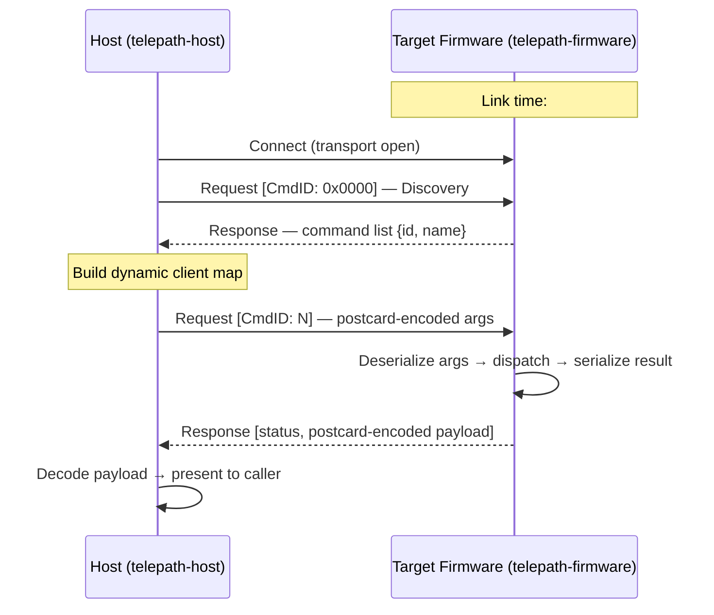

# Telepath

Schema-driven embedded RPC framework for Rust.

Telepath eliminates the dual-maintenance problem in embedded communication: the
firmware function definition is the interface definition. A single `#[command]`
attribute generates the wire shim, registers metadata, and enables dynamic
discovery — no IDL files, no manual protocol sync.

## Architecture



### Workspace structure

| Path | Role |
|------|------|
| `crates/telepath-wire` | Shared wire types — `no_std`, no alloc |
| `crates/telepath-macros` | `#[command]` proc-macro |
| `crates/telepath-firmware` | Target-side RPC server — `no_std` |
| `crates/telepath-host` | Host-side RPC client — `std` |
| `examples/nrf52840-dk` | Standalone firmware example (workspace-excluded) |

### Framing

| Direction | Method | Rationale |
|-----------|--------|-----------|
| Host → Target | COBS | Minimal decoder on MCU: `read_until(0x00)` |
| Target → Host | rzCOBS | Zero-compression improves throughput for sparse sensor data |

Both directions use `0x00` as the frame delimiter. rzCOBS guarantees no `0x00`
in encoded output, so the same delimiter logic works upstream and downstream.

### Packet model

Two packet types only (`Request` / `Response`), following the ONC RPC RFC 5531
CALL/REPLY model. Errors live in `ResponseStatus`, not as separate packet types.
CmdID `0x0000` is reserved for the Command Discovery Protocol (CDP).

## Prerequisites

| Tool | Purpose |
|------|---------|
| Rust stable | Build host workspace |
| `rustup target add thumbv7em-none-eabi` | Firmware cross-compilation |
| `probe-rs` | Flash and run firmware on nRF52840-DK |
| `just` | Task runner (optional but recommended) |

## Build

```
# Host workspace
cargo build --workspace

# Run host tests
cargo test --workspace

# Firmware example — must cd so .cargo/config.toml is discovered
cd examples/nrf52840-dk && cargo build --release

# Flash to hardware
cd examples/nrf52840-dk && cargo run --release
```

## CI / Quality gates

```
# Format check
cargo fmt --all -- --check

# Clippy (warnings are errors)
cargo clippy --workspace -- -D warnings

# All checks at once
just ci
```

## License

Licensed under either of

- [MIT License](LICENSE-MIT)
- [Apache License, Version 2.0](LICENSE-APACHE)

at your option.
