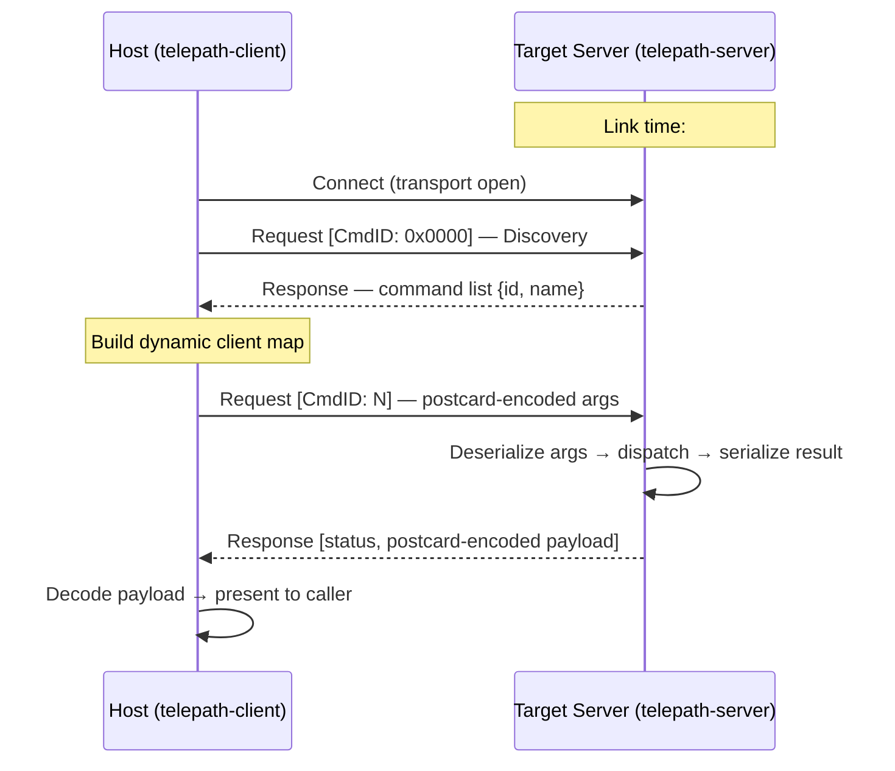

# Telepath

**Write `#[command] fn`, get a discoverable RPC server — anywhere a byte-stream goes.**

Telepath lets you expose any MCU-side logic over the wire so you can call it
interactively from a host shell or an AI agent — giving you real hardware feel while
validating behaviour and API ergonomics without instrumenting tests.

It splits the problem in two:
- **Server (target):** command definitions and a poll loop. No shell, no scheduler integration, no allocator.
- **Client (host):** `telepath shell` (the unified CLI) for interactive use; `telepath-client` lib for building your own host or MCP server frontend.

Three things make it unusual:
1. **One attribute, zero boilerplate.** `#[command]` generates the wire shim, schema metadata, and link-time registration. No IDL, no manual sync.
2. **Schemas travel on the wire.** The host discovers commands at runtime; firmware changes never silently break the client.
3. **Transport is a two-method trait.** No RTOS lock-in. UART, RTT, USB-CDC, BLE, mpsc — all valid backends.

Minimal example:

```rust
#[command]
fn ping() -> u32 { 0xDEAD_BEEF }
```

That one attribute registers `ping` in the command table, generates its wire shim, and embeds its postcard schema — no further wiring needed.

## Architecture



### Workspace structure

Telepath is a five-crate workspace (`telepath-wire`, `telepath-macros`,
`telepath-server`, `telepath-client`, `examples/host-pty-server`) plus two
workspace-excluded crates (`tools/telepath`, `examples/nrf52840-ping`).
See [AGENTS.md § Workspace Overview](AGENTS.md#workspace-overview) for the
full table with target triples and Cargo feature flags.

### Framing

| Direction | Method | Rationale |
|-----------|--------|-----------|
| Host → Target | COBS | Minimal decoder on MCU: `read_until(0x00)` |
| Target → Host | COBS (rzCOBS planned) | rzCOBS improves throughput for sparse sensor data — see [C2 in the MVP roadmap](https://github.com/tarotene/telepath/issues/3) |

Both directions use `0x00` as the frame delimiter.

### Packet model

Two packet types only (`Request` / `Response`), following the ONC RPC RFC 5531
CALL/REPLY model. Errors live in `ResponseStatus`, not as separate packet types.
CmdID `0x0000` is reserved for the Command Discovery Protocol (CDP).

## Agent-ready by design

Telepath's wire protocol is designed so that a host can enumerate commands and their
full type signatures at runtime — the foundation needed to drive a Telepath server
from an AI agent without hand-written tool descriptors.

### Schemas on the wire

- `DiscoveryEntry.args_schema` / `ret_schema` carry real `postcard-schema` bytes
  (`NamedType` serialised with postcard) over the wire.
- `client.discover()` fetches all commands via CDP paging; the result lands in
  `SchemaCache`, keyed by command ID.
- `examples/host-pty-server` exercises this end-to-end over a real PTY transport — no hardware required.

### MCP tool auto-generation

The `telepath mcp` subcommand (`tools/telepath`) auto-generates MCP tool descriptors from live
`#[command]` metadata — zero hand-written tool definitions required:

1. `client.discover()` fetches all commands; each `SchemaEntry` holds
   `args_schema` / `ret_schema` as postcard-encoded `OwnedNamedType` bytes.
2. `SchemaEntry::decoded_args_schema()` / `decoded_ret_schema()` decode
   those bytes into `postcard_schema::schema::owned::OwnedNamedType`.
3. `schema_to_json::named_type_to_json_schema()` maps `OwnedNamedType`
   to a JSON Schema value suitable as the MCP `inputSchema`.
4. `bridge::invoke()` converts MCP tool call arguments (JSON) to postcard,
   calls `client.call_raw()`, and converts the response back to JSON.

```text
// discover → MCP tool (actual API)
let _n = client.discover()?;
for entry in client.schema_cache().iter() {
    let args_schema = entry.decoded_args_schema()?;
    let json_schema = named_type_to_json_schema(&args_schema);
    // rmcp::Tool auto-registered with json_schema as inputSchema
}
// MCP tool call → bridge::invoke → call_raw → JSON response
```

See [`docs/mcp-integration.md`](docs/mcp-integration.md) and
[`tools/telepath/README.md`](tools/telepath/README.md)
for setup instructions, including using it from Claude Code.

## Quickstart

The fastest way to see Telepath in action requires no hardware.

```bash
git clone https://github.com/tarotene/telepath.git
cd telepath
just host-pty-smoke
```

Expected output:

```
ping -> 0xDEADBEEF
```

`host-pty-smoke` starts `examples/host-pty-server` (a `TelepathServer` over a PTY
master), then drives it from `telepath shell --transport serial` via the slave end.
The full wire path (postcard serialization + COBS framing) runs identically to real
hardware. Switching to an MCU is purely a transport swap.

## Prerequisites

| Tool | Purpose |
|------|---------|
| Rust stable | Build host workspace |
| `rustup target add thumbv7em-none-eabi` | Firmware cross-compilation |
| `probe-rs` | Flash and run firmware on nRF52840-DK |
| `just` | Task runner (optional but recommended) |
| `cocogitto` | Conventional Commits enforcement (commit-msg hook) |

> **MSRV:** See [Supported Rust Version](#supported-rust-version) below for the
> declared Minimum Supported Rust Version and policy.

## Git hooks setup

The repository ships hooks under `.githooks/` that enforce quality gates at
commit and push time. They are **not active by default** — Git reads hooks from
`.git/hooks/` unless told otherwise.

Run once per clone to wire them up:

```sh
git config --local core.hooksPath .githooks
```

| Hook | Runs on | Action | Typical wall time |
|------|---------|--------|-------------------|
| `commit-msg` | every `git commit` | `cog verify` (Conventional Commits) | < 1 s |
| `pre-commit` | every `git commit` | `just fmt-check` | < 1 s |
| `pre-push` | every `git push` | `just clippy` + `just test` | ~30 s |

**Why this split?** Commits happen frequently, so `pre-commit` runs only the
instant format check. Pushes are less frequent and signal intent to share code,
so `pre-push` runs the slower static analysis and test suite. The full CI gate
(`just ci`) additionally runs the PTY-based `host-pty-server` smoke (`host-pty-smoke`) and the `telepath` CLI tests
(`mcp-test`), and is intentionally left to CI — see [CI / Quality gates](#ci--quality-gates). `commit-msg` fires before `pre-commit` and validates only the message format via cocogitto — instant feedback with no build step.

### Troubleshooting

**Hook does not run.** Check `git config core.hooksPath`. If it prints a path
other than `.githooks` (e.g. `~/.config/git/hooks` set globally), the
repo-local setting above overrides it once you run the command.

**`just: command not found`.** Install via `cargo install just` or your OS
package manager.

**`cog: command not found`.** Install cocogitto via `cargo install --locked cocogitto`.

**Bypass in an emergency.** Pass `--no-verify` to skip hooks:
`git commit --no-verify`. The CI gate still applies on every PR.

## Build

```bash
# Host workspace
cargo build --workspace

# Run host tests
cargo test --workspace

# Firmware example — must cd so .cargo/config.toml is discovered
cd examples/nrf52840-ping && cargo build --release

# Flash to hardware (downloads and exits; probe is released immediately)
cd examples/nrf52840-ping && cargo run --release

# Unified CLI — must cd because it is workspace-excluded
cd tools/telepath && cargo build

# 1-shot ping (firmware must already be flashed)
cd tools/telepath && cargo run -- shell --exec ping

# Interactive REPL
cd tools/telepath && cargo run -- shell
```

> **Pre-built binaries:** Host-side tools (`telepath shell`, `telepath mcp`)
> are currently distributed as source only. Pre-built binary distribution
> via GitHub Releases is planned in
> [#52](https://github.com/tarotene/telepath/issues/52).

## Real hardware: nRF52840-DK

See [`examples/nrf52840-ping/README.md`](examples/nrf52840-ping/README.md) for the
full hardware walk-through (udev rules, APPROTECT unlock, RTT channel layout).

```bash
# Flash firmware (downloads and exits; probe is released)
cd examples/nrf52840-ping && cargo run --release

# Ping over RTT (RPC traffic on channel 1)
cd tools/telepath && cargo run -- shell --exec ping
```

## Using telepath as a library

### Server side (target)

```toml
# Cargo.toml
[dependencies]
telepath-server = { git = "https://github.com/tarotene/telepath", branch = "main" }
postcard          = { version = "1", default-features = false }
```

```rust
use telepath_server::{command, TelepathServer};

// 1. Annotate commands with #[command]. The macro generates a type-erased shim,
//    a CommandMetadata const, and a linkme registration — no boilerplate required.
#[command]
fn ping() -> u32 { 0xDEAD_BEEF }

// Peripheral state can be injected type-safely with #[resource]:
// #[command]
// fn set_led(#[resource] led: &mut MyLed, on: bool) -> bool { led.set(on) }

// 2. Implement `transport::Transport` for your byte-stream peripheral
//    (UART, RTT, USB …).
//    Non-blocking: `fn read(&mut self, &mut [u8]) -> usize` / `fn write(&mut self, &[u8]) -> usize`.

let mut server = TelepathServer::<MyTransport, 512>::new(
    transport,
    telepath_server::commands(), // linkme-collected at link time
);
loop { server.poll(); }
```

### Host side

```toml
[dependencies]
telepath-client = { git = "https://github.com/tarotene/telepath", branch = "main" }
postcard      = "1"
```

```rust
use telepath_client::TelepathClient;

// transport: anything implementing `std::io::Read + std::io::Write`
let mut client = TelepathClient::new(transport);
let payload = client.call_raw(0x0001, &[])?;
let val: u32 = postcard::from_bytes(&payload)?;
println!("ping -> 0x{:08X}", val);
```

## CI / Quality gates

```bash
# Format check
cargo fmt --all -- --check

# Clippy (warnings are errors)
cargo clippy --workspace -- -D warnings

# All checks at once
just ci
```

See [CHANGELOG.md](./CHANGELOG.md) for the project history.

## Supported Rust Version

Telepath declares a Minimum Supported Rust Version (MSRV) of **1.88**.
This applies to all workspace members and the excluded crates
(`tools/telepath`, `examples/nrf52840-ping`).
The MSRV is verified in CI via the `msrv` job (`dtolnay/rust-toolchain@1.88.0`).

A bump to the MSRV is treated as a `MINOR` change under SemVer for pre-1.0
releases. See [AGENTS.md § Toolchain](AGENTS.md#toolchain) for the
full MSRV policy including manifest updates and commit convention.

## Dependency updates

[Renovate](https://docs.renovatebot.com/) opens dependency-bump PRs every Monday morning (JST).
All Renovate PRs require human review; auto-merge is disabled.
Embedded HAL updates (`embassy-*`, `nrf-pac`, `cortex-m-rt`, …) carry the
`needs-smoke-test` label and require an on-device `just firmware-ping` run on
nRF52840-DK before merging.

## License

Licensed under either of

- [MIT License](LICENSE-MIT)
- [Apache License, Version 2.0](LICENSE-APACHE)

at your option.
