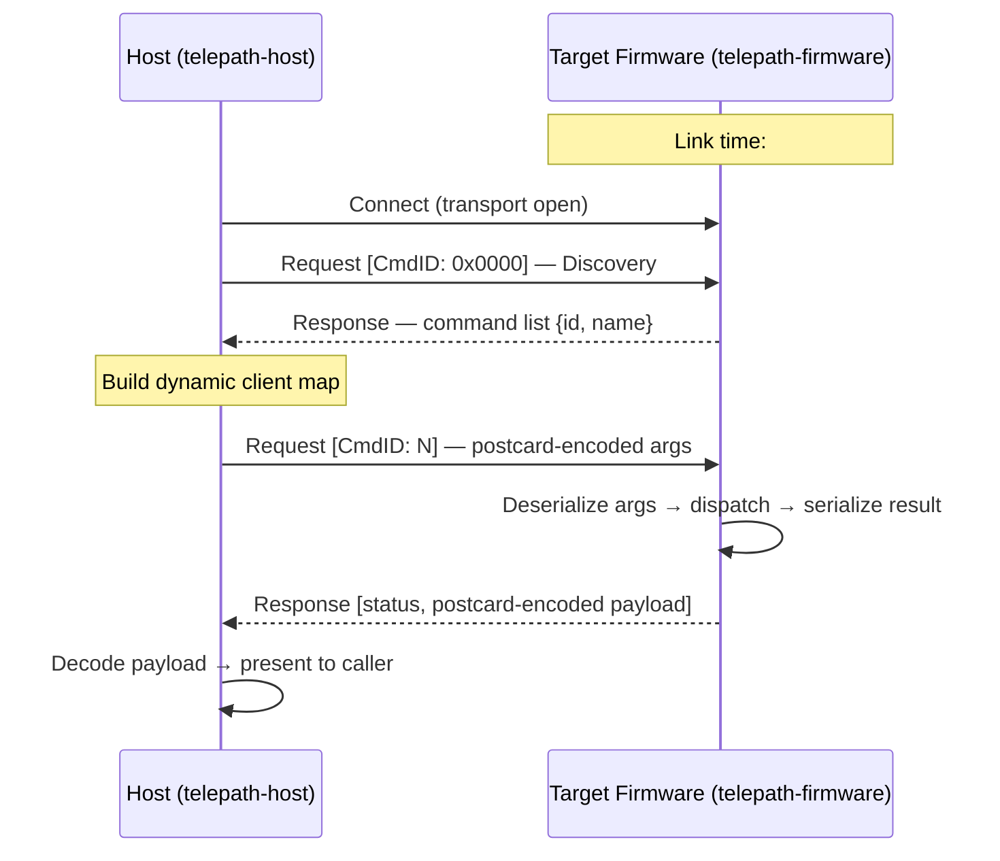

# Telepath

Schema-driven embedded RPC framework for Rust.

Telepath eliminates the dual-maintenance problem in embedded communication: the
firmware function definition is the interface definition. A single `#[command]`
attribute generates the wire shim, registers metadata, and enables dynamic
discovery — no IDL files, no manual protocol sync.

## Architecture



### Workspace structure

| Path | Role |
|------|------|
| `crates/telepath-wire` | Shared wire types — `no_std`, no alloc |
| `crates/telepath-macros` | `#[command]` proc-macro |
| `crates/telepath-firmware` | Target-side RPC server — `no_std` |
| `crates/telepath-host` | Host-side RPC client — `std` |
| `examples/host-emulator` | In-process server+client emulator — no hardware required |
| `examples/nrf52840-dk` | Standalone firmware example (workspace-excluded) |
| `tools/telepath-cli` | Host-side CLI over RTT (workspace-excluded) |

### Framing

| Direction | Method | Rationale |
|-----------|--------|-----------|
| Host → Target | COBS | Minimal decoder on MCU: `read_until(0x00)` |
| Target → Host | COBS (rzCOBS planned) | rzCOBS improves throughput for sparse sensor data — see [C2 in the MVP roadmap](https://github.com/tarotene/telepath/issues/3) |

Both directions use `0x00` as the frame delimiter.

### Packet model

Two packet types only (`Request` / `Response`), following the ONC RPC RFC 5531
CALL/REPLY model. Errors live in `ResponseStatus`, not as separate packet types.
CmdID `0x0000` is reserved for the Command Discovery Protocol (CDP).

## Quickstart

The fastest way to see Telepath in action requires no hardware.

```
git clone https://github.com/tarotene/telepath.git
cd telepath
cargo run -p host-emulator
```

Expected output:

```
ping -> 0xDEADBEEF
```

The emulator runs a `TelepathServer` and `TelepathClient` on two OS threads
connected by `std::sync::mpsc` byte channels. The full wire path
(postcard serialization + COBS framing) executes identically to real hardware.
Switching to an MCU is purely a transport swap.

## Prerequisites

| Tool | Purpose |
|------|---------|
| Rust stable | Build host workspace |
| `rustup target add thumbv7em-none-eabi` | Firmware cross-compilation |
| `probe-rs` | Flash and run firmware on nRF52840-DK |
| `just` | Task runner (optional but recommended) |

## Build

```
# Host workspace
cargo build --workspace

# Run host tests
cargo test --workspace

# Firmware example — must cd so .cargo/config.toml is discovered
cd examples/nrf52840-dk && cargo build --release

# Flash to hardware (downloads and exits; probe is released immediately)
cd examples/nrf52840-dk && cargo run --release

# CLI tool — must cd because it is workspace-excluded
cd tools/telepath-cli && cargo build

# 1-shot ping (firmware must already be flashed)
cd tools/telepath-cli && cargo run -- ping

# Interactive REPL
cd tools/telepath-cli && cargo run
```

## Real hardware: nRF52840-DK

See [`examples/nrf52840-dk/README.md`](examples/nrf52840-dk/README.md) for the
full hardware walk-through (udev rules, APPROTECT unlock, RTT channel layout).

```
# Flash firmware (downloads and exits; probe is released)
cd examples/nrf52840-dk && cargo run --release

# Ping over RTT (RPC traffic on channel 1)
cd tools/telepath-cli && cargo run -- ping
```

## Using telepath as a library

### Firmware side

```toml
# Cargo.toml
[dependencies]
telepath-firmware = { git = "https://github.com/tarotene/telepath", branch = "main" }
postcard          = { version = "1", default-features = false }
```

```rust
use telepath_firmware::{command, TelepathServer};

// 1. Annotate commands with #[command]. The macro generates a type-erased shim,
//    a CommandMetadata const, and a linkme registration — no boilerplate required.
#[command]
fn ping() -> u32 { 0xDEAD_BEEF }

// 2. Implement `transport::Transport` for your byte-stream peripheral
//    (UART, RTT, USB …).
//    Non-blocking: `fn read(&mut self, &mut [u8]) -> usize` / `fn write(&mut self, &[u8]) -> usize`.

let mut server = TelepathServer::<MyTransport, 512>::new(
    transport,
    telepath_firmware::commands(), // linkme-collected at link time
);
loop { server.poll(); }
```

### Host side

```toml
[dependencies]
telepath-host = { git = "https://github.com/tarotene/telepath", branch = "main" }
postcard      = "1"
```

```rust
use telepath_host::TelepathClient;

// transport: anything implementing `std::io::Read + std::io::Write`
let mut client = TelepathClient::new(transport);
let payload = client.call_raw(0x0001, &[])?;
let val: u32 = postcard::from_bytes(&payload)?;
println!("ping -> 0x{:08X}", val);
```

## CI / Quality gates

```
# Format check
cargo fmt --all -- --check

# Clippy (warnings are errors)
cargo clippy --workspace -- -D warnings

# All checks at once
just ci
```

## License

Licensed under either of

- [MIT License](LICENSE-MIT)
- [Apache License, Version 2.0](LICENSE-APACHE)

at your option.
