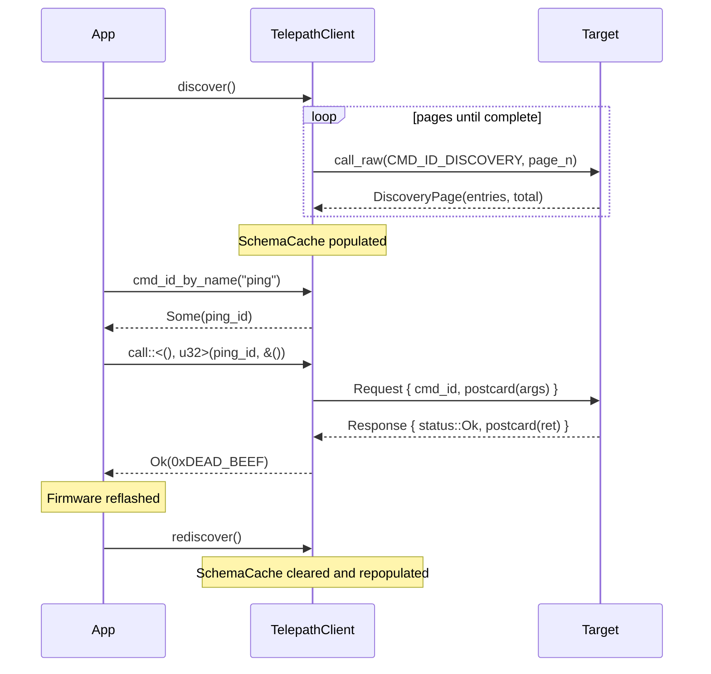

# telepath-client

Host-side RPC client library for [Telepath](../README.md) (`std`). Connects to a
target running `telepath-server` over any byte-stream transport
(`std::io::Read + std::io::Write`).

## Overview

`TelepathClient<T>` handles framing (COBS downstream, rzCOBS upstream), postcard serialization, sequence
numbering, and the Command Discovery Protocol (CDP). The typed `call::<Args, Ret>`
method is the primary API for host applications; `call_raw` remains available
as a low-level escape hatch.

## Transports

Select a transport feature at build time:

| Feature | Crate | When to use |
|---------|-------|-------------|
| `rtt` | `probe-rs` | Connected nRF52840-DK or similar; RTT channel 1 carries the wire |
| `serial` | `serialport` | PTY pair (`host-pty-server`), UART adapter, or any `/dev/tty*` port |

No transport feature is enabled by default; select `rtt` or `serial` explicitly.

```toml
# RTT (hardware target)
telepath-client = { version = "0.2", features = ["rtt"] }

# Serial / PTY
telepath-client = { version = "0.2", features = ["serial"] }
```

Both features can be enabled simultaneously. For hardware-free testing use the
`serial` feature against `examples/host-pty-server`.

## Quickstart

```rust
use telepath_client::TelepathClient;

// transport: anything implementing std::io::Read + std::io::Write
let mut client = TelepathClient::new(transport);

// Discover commands registered on the target.
client.discover()?;

// Resolve name → cmd_id, then issue a typed call.
let ping_id = client.cmd_id_by_name("ping").expect("ping not registered");
let result: u32 = client.call::<(), u32>(ping_id, &())?;
println!("ping -> 0x{:08X}", result);  // ping -> 0xDEADBEEF
```

## API surface

### `TelepathClient<T>`

| Method | Description |
|--------|-------------|
| `new(transport)` | Wrap a transport |
| `discover()` | Run CDP; populates the schema cache; returns entry count |
| `rediscover()` | Clear cache and re-run CDP (after firmware reconnect) |
| `cmd_id_by_name(name)` | Resolve a command name to its `cmd_id` |
| **`call::<Args, Ret>(cmd_id, args)`** | **Typed RPC call (primary API)** |
| `call_raw(cmd_id, args)` | Raw RPC call; caller owns ser/de |
| `schema_cache()` | Borrow the in-memory schema cache |
| `transport_mut()` | Mutable access to the underlying transport |

`T` must implement `std::io::Read + std::io::Write`.

### `HostError` variants

| Variant | Cause | Recovery |
|---------|-------|----------|
| `Io(String)` | Transport read/write failure | Check cable / serial port |
| `SeqMismatch { expected, got }` | Response seq number mismatch | Drain and retry; call `rediscover()` |
| `SystemError` | Target reported a system-level error | Check firmware logs |
| `AppError { code, message }` | Target reported an application-level error | Inspect `code` and `message` |
| `SerdeError(postcard::Error)` | postcard serialization/deserialization failed | Check Args/Ret types |
| `RequestPayloadTooLarge` | `args` exceeded `MAX_PAYLOAD_SIZE` (256 B) | Reduce payload |
| `ResponsePayloadTooLarge` | Response exceeded `MAX_PAYLOAD_SIZE` | Check firmware shim |
| `FrameTooLarge` | Received frame exceeded `MAX_FRAME_SIZE` (512 B) | Firmware issue |
| `FramingError` | Malformed rzCOBS frame from target | Check transport integrity |
| `DiscoveryStalled` | Discovery page returned zero entries mid-stream | Firmware bug |
| `DiscoveryProtocolError` | Discovery page returned inconsistent metadata | Firmware bug |

### `SchemaCache`

In-memory map from `cmd_id: u16` to `SchemaEntry` (name, arg/ret schema
bytes, arg names). Populated exclusively by `discover()` / `rediscover()`.

Cache coherence is guaranteed by design: `cmd_id` is derived from the command
name and input/output schemas, so any type change produces a new ID.

Use `SchemaEntry::decoded_args_schema()` / `decoded_ret_schema()` to obtain
`postcard_schema::schema::owned::OwnedNamedType` (required by `telepath mcp`
for JSON-schema generation).

## Discovery & schema cache lifecycle



## Build

```
cargo build -p telepath-client
cargo test -p telepath-client
```

## Limitations

- `SchemaCache` stores schema bytes as `Vec<u8>`; use
  `SchemaEntry::decoded_args_schema()` / `decoded_ret_schema()` to obtain
  `postcard_schema::schema::owned::OwnedNamedType`. MCP tool descriptors are
  auto-generated by the `telepath mcp` subcommand (`tools/telepath`).
