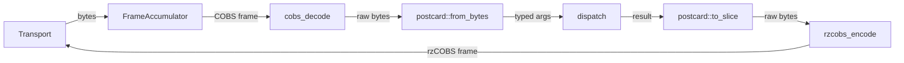

# telepath-server

RPC **server** library for embedded targets (`no_std`, no alloc).

Target-side Telepath RPC server. Runs on the MCU in `#![no_std]` mode.

Receives COBS-framed postcard requests from the host, dispatches them to
registered command handlers, and sends rzCOBS-framed postcard responses back.

## Architecture



## Key API

### `TelepathServer<T, N>`

| Method | Description |
|--------|-------------|
| `new(transport, commands)` | Create a server with a transport and a static command slice |
| `poll()` | Drain available bytes, process any complete frames; call in a loop |
| `dispatch(cmd_id, input, output)` | Manually dispatch a decoded payload (useful for testing) |
| `find_command(id)` | Look up a command by ID (linear scan over the static slice) |

`T` must implement `transport::Transport`. `N` is the internal buffer
size; use `512` or larger to accommodate max-payload frames.

### `transport::Transport` trait

```rust
pub trait Transport {
    fn read(&mut self, buf: &mut [u8]) -> usize;
    fn write(&mut self, buf: &[u8]) -> usize;
}
```

Both methods are non-blocking and return the number of bytes transferred.

### `CommandMetadata`

```rust
pub struct CommandMetadata {
    pub name: &'static str,
    pub id: u16,
    pub invoke: ShimFn,         // fn(&[u8], &mut [u8], &ResourceRegistry) -> Result<usize, DispatchError>
    pub args_schema: SchemaFn,  // fn(&mut [u8]) -> Result<usize, ()>
    pub ret_schema: SchemaFn,   // fn(&mut [u8]) -> Result<usize, ()>
    pub arg_names: &'static str, // comma-separated, e.g. "a,b"
}
```

For details on the generated `invoke`, `args_schema`, and `ret_schema` functions,
see [telepath-macros § Signature contract](../telepath-macros/README.md#signature-contract).

Register commands by passing a `&'static [CommandMetadata]` to `new()`.
Use `telepath_server::commands()` (linkme-collected at link time) to
pass all `#[command]`-annotated functions automatically.

### `ResourceRegistry`

Type-keyed container for `#[resource]`-injected values. Re-exported as
`telepath_server::ResourceRegistry`. Each resource type may appear at most
once; registering a second value of the same type panics at runtime
(fail-fast to prevent silent shadowing). Resources are added via the
`TelepathServer::resource(value)` builder method — see Usage below.

## Usage

```rust
use telepath_server::{command, TelepathServer};

#[command]
fn ping() -> u32 { 0xDEAD_BEEF }

// Resource args are injected from the server's ResourceRegistry, not over the wire.
#[command]
fn set_led(#[resource] led: &mut MyLed, on: bool) -> bool { led.set(on) }

let mut server = TelepathServer::<MyTransport, 512>::new(
    transport,
    telepath_server::commands(),
)
.resource(MyLed::new(pin));  // register each #[resource] type before polling
loop {
    server.poll();
}
```

> **Note:** The `#[command]` macro generates a shim that calls
> `postcard::from_bytes` / `postcard::to_slice` directly. Your firmware
> crate must add `postcard` as a direct dependency in its `Cargo.toml`
> in addition to `telepath-server`.

## Build

This crate targets both native (for tests) and `thumbv7em-none-eabi` (for firmware).

```
# Host tests
cargo test -p telepath-server

# Cross-compiled (requires the target to be added)
rustup target add thumbv7em-none-eabi
cargo build -p telepath-server --target thumbv7em-none-eabi
```


