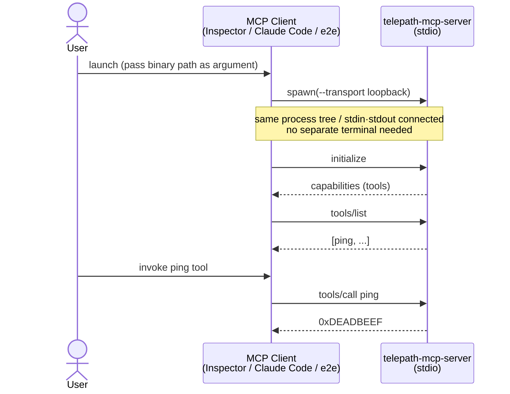

# telepath-mcp-server

MCP server that exposes every `#[command]` function on a connected Telepath
server as an MCP tool — zero hand-written tool descriptors required.

## Quick start (loopback, no hardware)

`telepath-mcp-server` is a stdio MCP server: the MCP **client** spawns the binary
as a child process and connects via stdin/stdout.  You do not need to run the server
manually in a separate terminal.



### Build

```bash
cd tools/telepath-mcp-server
cargo build
```

### Try it with Inspector

The Inspector spawns the binary itself — no need to `cargo run` first.

```bash
npx @modelcontextprotocol/inspector@latest ./target/debug/telepath-mcp-server --transport loopback
```

If the browser does not open automatically, navigate to **`http://localhost:6274`**.

Expected: `ping` tool appears in the Tools tab; selecting it and clicking
**Run Tool** returns `3735928559` (`0xDEADBEEF`).

## Tests

```bash
cargo test
```

| Suite | What it covers |
|---|---|
| `schema_to_json_table` | All `OwnedDataModelType` variants → JSON Schema mapping |
| `json_postcard_roundtrip` | encode → decode identity; native postcard oracle comparison |
| `end_to_end_loopback` | discover + invoke `ping` and `add` via full bridge stack |

## E2E tests (Playwright)

### Headless MCP protocol tests

Sends raw JSON-RPC over stdio directly to the server binary — no browser or
MCP SDK required.

```bash
# First-time setup
just mcp-e2e-install

# Run E2E tests
just mcp-e2e
```

Or without `just`:
```bash
cd tools/telepath-mcp-server/e2e
npm install
npm test
```

### Inspector UI tests (future)

`e2e/tests/inspector.spec.ts` contains the full browser-based test suite.
It is excluded from the default project due to the Tools panel issue described
in [Limitations](#limitations).  When that issue is resolved:

1. Uncomment the `inspector-ui` project block in `e2e/playwright.config.ts`
2. Install the browser:
   ```bash
   cd tools/telepath-mcp-server/e2e && npx playwright install chromium
   ```
3. Update selectors if the Inspector UI has changed since the last working run:
   ```bash
   cd tools/telepath-mcp-server/e2e && npm run codegen
   # Navigate to http://localhost:6274, click the Tools tab,
   # List Tools, and select ping — capture the current selectors
   ```
4. Run: `cd tools/telepath-mcp-server/e2e && npm run test:ui`

Known environment requirement: `DANGEROUSLY_OMIT_AUTH=true` is set by the
test `beforeEach` hook — this disables the Inspector proxy session-token check
so the browser can reach `http://localhost:6274` without a token in the URL.

## Architecture

See [`docs/mcp-integration.md`](../../docs/mcp-integration.md) for the full
architecture diagram and encoding contract.

## Using from Claude Code

`telepath-mcp-server` is an MCP server, so any MCP-compatible coding agent can use
it. The shortest path with [Claude Code](https://claude.com/claude-code):

### 1. Build the binary

```bash
cd tools/telepath-mcp-server
cargo build
```

### 2. Register with `claude mcp add`

```bash
claude mcp add --scope local --transport stdio telepath \
  -- "$(git rev-parse --show-toplevel)/tools/telepath-mcp-server/target/debug/telepath-mcp-server" \
  --transport loopback
```

This writes the server entry directly into `~/.claude.json` for this project,
bypassing any trust-dialog flow.  The server is available in every Claude Code
session you start from this directory from now on.

### 3. Verify

Start a new Claude Code session inside the repository and run `/mcp` to confirm
`telepath` appears with its discovered tools. For the loopback build, `ping` will
be listed.

### 4. Invoke a Telepath command

In a Claude Code prompt:

> Call the `ping` MCP tool and report the result.

Expected: the agent invokes the tool and returns `3735928559` (`0xDEADBEEF`).

## Limitations

### Inspector UI automated tests disabled

`e2e/tests/inspector.spec.ts` exists but is excluded from the default Playwright
project (`mcp-headless`).  Root cause: after clicking **List Tools** in Inspector
v0.21.x the Tools panel does not populate even though `tools/list` appears in the
History panel — likely a React render timing issue.  The headless tests in
`mcp.spec.ts` cover the same protocol behaviors in the meantime.  See
[Inspector UI tests (future)](#inspector-ui-tests-future) for the
recovery path.

## Notes

- This crate is **excluded from the workspace** — always `cd` into it before
  running `cargo` commands.
- `stdout` carries the MCP JSON-RPC stream; all logging goes to `stderr`.
- The loopback transport is currently the only built-in transport — see #36 for RTT/serialport support.
