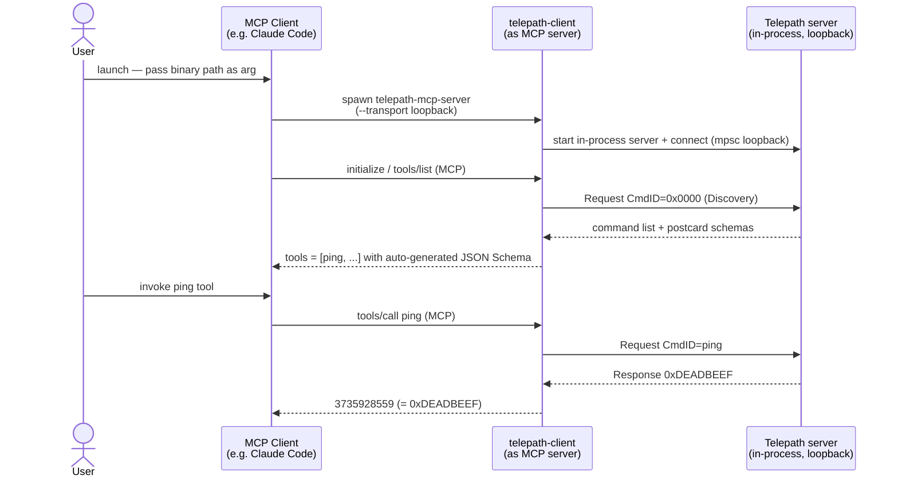

# telepath-mcp-server

MCP server that exposes every `#[command]` function on a connected Telepath
server as an MCP tool — zero hand-written tool descriptors required.

## Quick start (loopback, no hardware)

`telepath-mcp-server` is a bridge binary that wraps a `telepath-client` as a
stdio MCP server.  An MCP client spawns it as a child process; in **loopback**
mode the binary additionally hosts an in-process Telepath server so every
`#[command]` function is exposed as an MCP tool with zero hand-written
descriptors.

For the wider protocol design see the
[Agent-ready by design](../../README.md#agent-ready-by-design) section of the
root README; for the bridge's internal module layout and JSON↔postcard
encoding contract see [`docs/mcp-integration.md`](../../docs/mcp-integration.md).



### Build

```bash
cd tools/telepath-mcp-server
cargo build
```

## Tests

```bash
cargo test
```

| Suite | What it covers |
|---|---|
| `schema_to_json_table` | All `OwnedDataModelType` variants → JSON Schema mapping |
| `json_postcard_roundtrip` | encode → decode identity; native postcard oracle comparison |
| `end_to_end_loopback` | discover + invoke `ping` and `add` via full bridge stack |
| `serial_pty_smoke` | full wire path (COBS + postcard) over a Unix pty pair (unix only) |

## Architecture

See [`docs/mcp-integration.md`](../../docs/mcp-integration.md) for the full
architecture diagram and encoding contract.

## Using from Claude Code

`telepath-mcp-server` is an MCP server, so any MCP-compatible coding agent can use
it. The shortest path with [Claude Code](https://claude.com/claude-code):

### 1. Build the binary

```bash
cd tools/telepath-mcp-server
cargo build
```

### 2. Register with `claude mcp add`

```bash
claude mcp add --scope local --transport stdio telepath \
  -- "$(git rev-parse --show-toplevel)/tools/telepath-mcp-server/target/debug/telepath-mcp-server" \
  --transport loopback
```

This writes the server entry directly into `~/.claude.json` for this project,
bypassing any trust-dialog flow.  The server is available in every Claude Code
session you start from this directory from now on.

### 3. Verify

Start a new Claude Code session inside the repository and run `/mcp` to confirm
`telepath` appears with its discovered tools. For the loopback build, `ping` will
be listed.

### 4. Invoke a Telepath command

In a Claude Code prompt:

> Call the `ping` MCP tool and report the result.

Expected: the agent invokes the tool and returns `3735928559` (`0xDEADBEEF`).

## Notes

- This crate is **excluded from the workspace** — always `cd` into it before
  running `cargo` commands.
- `stdout` carries the MCP JSON-RPC stream; all logging goes to `stderr`.

## Transports

| Transport | Flag | Notes |
|---|---|---|
| Loopback | `--transport loopback` (default) | No hardware required; built-in demo `ping` command |
| RTT | `--transport rtt` | J-Link / CMSIS-DAP probe via probe-rs. Use `--chip` and `--rtt-control-block-addr` (or env `TELEPATH_RTT_CONTROL_BLOCK_ADDR`) to configure |
| Serial | `--transport serial:<path>` | USB-CDC or UART. Use `--baud` to set baud rate (default: 115200) |

See [`docs/mcp-integration.md`](../../docs/mcp-integration.md) for full usage examples.
