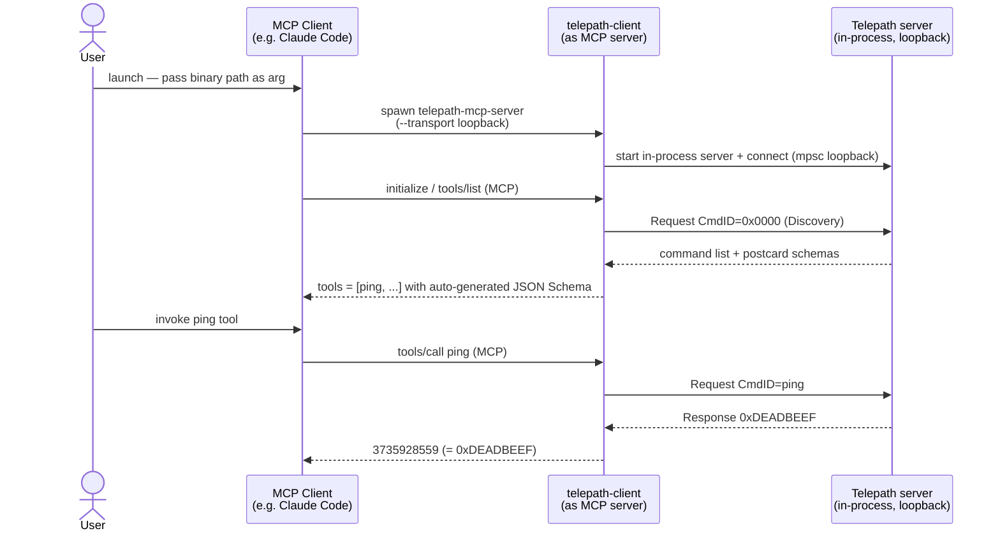

# telepath-mcp-server

MCP server that exposes every `#[command]` function on a connected Telepath
server as an MCP tool — zero hand-written tool descriptors required.

## Quick start (loopback, no hardware)

`telepath-mcp-server` is a bridge binary that wraps a `telepath-client` as a
stdio MCP server.  An MCP client spawns it as a child process; in **loopback**
mode the binary additionally hosts an in-process Telepath server so every
`#[command]` function is exposed as an MCP tool with zero hand-written
descriptors.

For the wider protocol design see the
[Agent-ready by design](../../README.md#agent-ready-by-design) section of the
root README; for the bridge's internal module layout and JSON↔postcard
encoding contract see [`docs/mcp-integration.md`](../../docs/mcp-integration.md).



### Build

```bash
cd tools/telepath-mcp-server
cargo build
```

## Tests

```bash
cargo test
```

| Suite | What it covers |
|---|---|
| `schema_to_json_table` | All `OwnedDataModelType` variants → JSON Schema mapping |
| `json_postcard_roundtrip` | encode → decode identity; native postcard oracle comparison |
| `end_to_end_loopback` | discover + invoke `ping` and `add` via full bridge stack |

## Architecture

See [`docs/mcp-integration.md`](../../docs/mcp-integration.md) for the full
architecture diagram and encoding contract.

## Using from Claude Code

`telepath-mcp-server` is an MCP server, so any MCP-compatible coding agent can use
it. The shortest path with [Claude Code](https://claude.com/claude-code):

### 1. Build the binary

```bash
cd tools/telepath-mcp-server
cargo build --release
```

Both `loopback` and `rtt` features are included in the default build
(`default = ["loopback", "rtt"]`); no extra flags are needed.
Use `target/debug/telepath-mcp-server` instead for a faster (but slower-running) dev build.

### 2. Register with `claude mcp add`

> Note: the `--` separator is required to distinguish Claude Code's own flags
> (before `--`) from the arguments passed to the `telepath-mcp-server` binary
> (after `--`). Both use a `--transport` flag with different meanings.

#### Loopback (no hardware required)

```bash
claude mcp add --scope local telepath \
  -- "$(git rev-parse --show-toplevel)/tools/telepath-mcp-server/target/release/telepath-mcp-server" \
  --transport loopback
```

#### RTT (flashed nRF52840-DK)

Flash the firmware first, then register:

```bash
cd examples/nrf52840-ping && cargo run --release
```

```bash
claude mcp add --scope local telepath \
  -- "$(git rev-parse --show-toplevel)/tools/telepath-mcp-server/target/release/telepath-mcp-server" \
  --transport rtt --chip nRF52840_xxAA
```

Optional RTT flags:

| Flag | Default | Description |
|------|---------|-------------|
| `--rtt-control-block-addr <hex>` | `0x20000000` | RTT control block address; also settable via `TELEPATH_RTT_CONTROL_BLOCK_ADDR` env var |
| `--no-reset` | disabled | Skip automatic chip reset retry when RTT control block is not found on attach |

This writes the server entry into `.claude/settings.local.json` for this project.
The server is available in every Claude Code session you start from this directory.

### 3. Verify

Start a new Claude Code session inside the repository and run `/mcp` to confirm
`telepath` appears. The listed tools are discovered at runtime from the connected
server — for loopback the built-in `ping` command will appear; for RTT, all
`#[command]` functions registered in the flashed firmware will appear.

### 4. Invoke a Telepath command

In a Claude Code prompt:

> Call the `ping` MCP tool and report the result.

Expected: the agent invokes the tool and returns `3735928559` (`0xDEADBEEF`).

## Notes

- This crate is **excluded from the workspace** — always `cd` into it before
  running `cargo` commands.
- `stdout` carries the MCP JSON-RPC stream; all logging goes to `stderr`.
- serialport transport (`--transport serial`) is not yet implemented — see #36.
