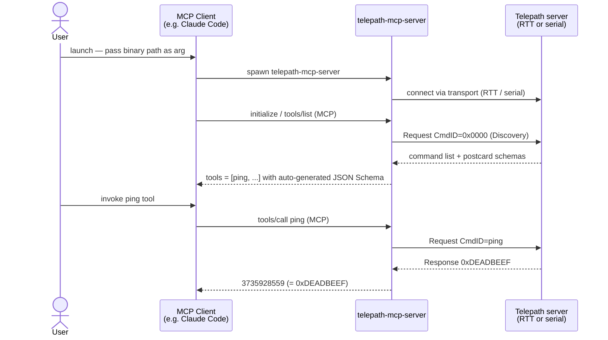

# telepath-mcp-server

MCP server that exposes every `#[command]` function on a connected Telepath
server as an MCP tool — zero hand-written tool descriptors required.

Transport is selected **at build time** via Cargo features:

| Feature | Transport | Build command |
|---------|-----------|---------------|
| `rtt` *(default)* | probe-rs RTT — connects to a flashed device | `cargo build --release` |
| `serial` | CDC-ACM serial port or PTY | `cargo build --release --no-default-features --features serial` |

For the wider protocol design see the
[Agent-ready by design](../../README.md#agent-ready-by-design) section of the
root README; for the bridge's internal module layout and JSON↔postcard
encoding contract see [`docs/mcp-integration.md`](../../docs/mcp-integration.md).



## Build

```bash
cd tools/telepath-mcp-server

# RTT build (default — connects to a flashed device)
cargo build --release

# Serial build (CDC-ACM device or host-pty-server PTY)
cargo build --release --no-default-features --features serial
```

## Tests

```bash
cd tools/telepath-mcp-server
cargo test
```

| Suite | What it covers |
|---|---|
| `schema_to_json_table` | All `OwnedDataModelType` variants → JSON Schema mapping |
| `json_postcard_roundtrip` | encode → decode identity; native postcard oracle comparison |
| `end_to_end_loopback` | discover + invoke `ping` and `add` via full bridge stack over in-process mpsc transport pair |
| `cpu_commands_e2e` | CPU-only commands (add, crc32, echo) via full bridge |
| `nrf52840_sensors_e2e` | Sensor commands end-to-end |
| `resources_prompts` | MCP resources and prompts capabilities |

## Architecture

See [`docs/mcp-integration.md`](../../docs/mcp-integration.md) for the full
architecture diagram and encoding contract.

## Using from Claude Code

`telepath-mcp-server` is an MCP server, so any MCP-compatible coding agent can use
it. The shortest path with [Claude Code](https://claude.com/claude-code):

### 1. Build the binary

**RTT build** (real hardware — nRF52840-DK or similar):

```bash
cd tools/telepath-mcp-server
cargo build --release
```

**Serial build** (hardware-free via `host-pty-server`, or CDC-ACM device):

```bash
cd tools/telepath-mcp-server
cargo build --release --no-default-features --features serial
```

### 2. Connect to a Telepath server

#### RTT (flashed nRF52840-DK)

Flash the firmware first so the probe is released before the MCP server attaches:

```bash
cd examples/nrf52840-ping && cargo run --release
```

#### Serial — hardware-free via `host-pty-server`

```bash
# From the repo root in a separate terminal (host-pty-server is a workspace member):
cargo run -p host-pty-server
# HOST_PTY_SERVER_PATH=/dev/pts/N  ← use this path below
```

### 3. Register with `claude mcp add`

#### RTT (flashed device)

```bash
claude mcp add --scope local telepath \
  -- "$(git rev-parse --show-toplevel)/tools/telepath-mcp-server/target/release/telepath-mcp-server" \
  --chip nRF52840_xxAA
```

Optional RTT flags:

| Flag | Default | Description |
|------|---------|-------------|
| `--rtt-control-block-addr <hex>` | `0x20000000` | RTT control block address; also settable via `TELEPATH_RTT_CONTROL_BLOCK_ADDR` env var |
| `--no-reset` | disabled | Skip automatic chip reset retry when RTT control block is not found on attach |

#### Serial (CDC-ACM device or host-pty-server PTY)

```bash
claude mcp add --scope local telepath \
  -- "$(git rev-parse --show-toplevel)/tools/telepath-mcp-server/target/release/telepath-mcp-server" \
  --port /dev/ttyACM0
```

Replace `/dev/ttyACM0` with the slave PTY path printed by `host-pty-server`, or your
CDC-ACM device path. Optional: `--baud <rate>` (default `115200`).

This writes the server entry into `.claude/settings.local.json` for this project.
The server is available in every Claude Code session you start from this directory.

### 4. Verify

Start a new Claude Code session inside the repository and run `/mcp` to confirm
`telepath` appears. The tools listed are discovered at runtime from the connected
Telepath server — all `#[command]` functions registered in the firmware appear as
MCP tools automatically.

### 5. Invoke a Telepath command

In a Claude Code prompt:

> Call the `ping` MCP tool and report the result.

Expected: the agent invokes the tool and returns `3735928559` (`0xDEADBEEF`).

## Notes

- This crate is **excluded from the workspace** — always `cd` into it before
  running `cargo` commands.
- `stdout` carries the MCP JSON-RPC stream; all logging goes to `stderr`.
